# Laporan Proyek Machine Learning - Sri Kresna Maha Dewa

## Domain Proyek
**Latar Belakang**:
Proyek ini bertujuan untuk melakukan prediksi harga laptop berdasarkan berbagai fitur dan variabel tertentu. Kondisi pasar yang dinamis, termasuk faktor teknologi terkini, merek, spesifikasi, dan ulasan pengguna, membuat prediksi harga menjadi tantangan yang menarik. Solusi dari proyek ini dapat membantu :

1. Konsumen: Dengan model prediktif ini, konsumen dapat memperoleh perkiraan harga laptop berdasarkan fitur-fitur tertentu. Ini dapat membantu mereka dalam membuat keputusan pembelian yang lebih baik dan menghindari pembayaran berlebihan.
2. Pengecer: Pengecer dapat menggunakan model ini untuk menentukan harga jual produk mereka berdasarkan fitur-fitur yang dimiliki oleh laptop. Ini dapat membantu mereka dalam strategi penetapan harga dan persediaan.
3. Produsen: Produsen dapat menggunakan model ini untuk memahami fitur apa yang paling mempengaruhi harga laptop. Informasi ini dapat digunakan untuk merancang produk baru atau memodifikasi produk yang ada untuk memaksimalkan keuntungan.

## Business Understanding
Solusi prediksi harga laptop ini memiliki dampak positif pada berbagai situasi dan kasus penggunaan. Misalnya, bagi konsumen yang ingin menentukan anggaran belanja laptop, solusi ini memungkinkan mereka untuk merencanakan pembelian sesuai dengan anggaran yang dimiliki. Pengecer juga dapat memanfaatkan model ini untuk menentukan produk apa yang akan dimasukkan ke dalam stok mereka, dengan memprediksi harga produk baru berdasarkan spesifikasi tertentu. Produsen dapat menggunakan solusi ini untuk menentukan harga yang kompetitif, mempertimbangkan spesifikasi produk dan tren pasar.

Analisis pengaruh fitur terhadap harga juga menjadi keuntungan bagi perusahaan, membantu mereka memahami faktor-faktor yang paling memengaruhi penentuan harga laptop. Selain itu, konsumen dapat memanfaatkan solusi ini untuk membandingkan harga antar merek laptop, membantu mereka membuat keputusan pembelian yang lebih informasional. Secara keseluruhan, solusi ini tidak hanya memberikan prediksi harga yang akurat, tetapi juga memberikan wawasan yang berharga bagi semua pemangku kepentingan dalam ekosistem pasar laptop.

### Problem Statements

- Bagaimana memprediksi harga laptop dengan akurasi tinggi?
- Bagaimana faktor-faktor tertentu mempengaruhi harga laptop?

### Goals

- Menciptakan model prediktif yang dapat memprediksi harga laptop.
- Mengidentifikasi fitur yang paling berpengaruh terhadap penentuan harga.

### Solution statements

- Menggunakan *ensemble model* yang sudah umum digunakan dan memiliki performa tinggi.
- Menerapkan *baseline model* yaitu model pertama tanpa pemrosesan terhadap data, hal ini dilakukan untuk melihat seberapa kompleks masalah yang dihadapi. Melalui *baseline model* ini, dapat dibandingkan dengan model terakhir sebagai tolak ukur.
- Melakukan *feature engineering* dari korelasi antar variable dalam datasets untuk menciptakan sebuah fitur baru yang lebih representatif untuk model.
- Melakukan *hyperparameter tuning* untuk melihat sejauh mana model dapat berkembang.

## Data Understanding
Datasets ini memberikan informasi komprehensif tentang berbagai laptop, menangkap beragam fitur dan spesifikasi. Ini adalah sumber berharga bagi mereka yang tertarik untuk mengeksplorasi dan memprediksi harga laptop berdasarkan karakteristiknya.

**Informasi Data**:
- Jumlah data : 893
- Kondisi data : tidak ada nilai kosong ataupun duplikat(null value/NaN)
- Sumber data : [Laptop Price Prediction Dataset](https://www.kaggle.com/datasets/jacksondivakarr/laptop-price-prediction-dataset)

### Variabel-variabel pada datasets adalah sebagai berikut :

- Unnamed: 0.1 : Index column
- Unnamed: 0 : Extra column
- brand : Merek atau pabrikan laptop
- name : nama model laptop
- price : harga retail dari laptop
- spec_rating : rating dari keseluruhan spesifikasi laptop
- processor : informasi umum tentang prosesor laptop
- cpu : informasi umum tentang CPU laptop
- Ram : jumlah RAM dalam GB
- Ram_type : tipe dari RAM yang digunakan
- ROM : jumlah dari ROM
- ROM_type : tipe dari ROM yang digunakan
- GPU : informasi umum tentang GPU laptop
- display_size : informasi ukuran tampilan
- resolution_width : informasi lebar resolusi
- resolution_height : informasi tinggi resolusi
- OS : tipe dari OS yang digunakan
- warranty : jumlah garansi yang ditawarkan

### EDA (Exploratory Data Analysis) :

Distribusi kolom target :

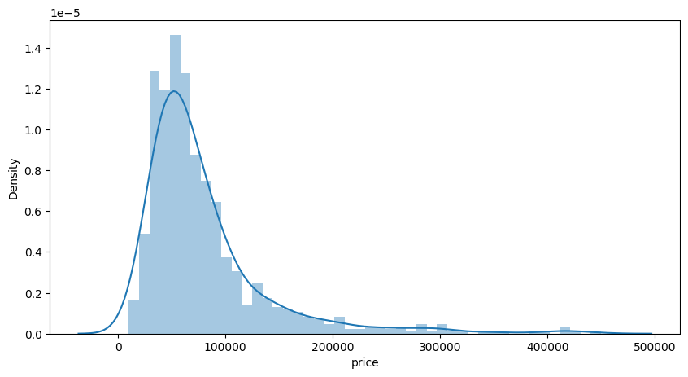

Gambar 1. Distribusi target

Plot hubungan fitur dengan target :

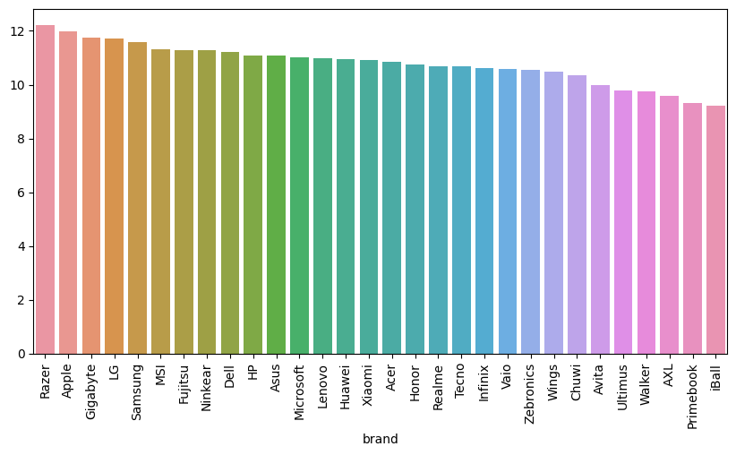

Gambar 2. Plot hubungan fitur *brand* dengan target

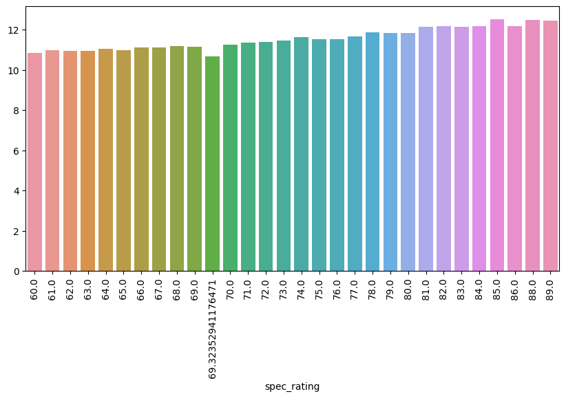

Gambar 3. Plot hubungan fitur *spec rating* dengan target

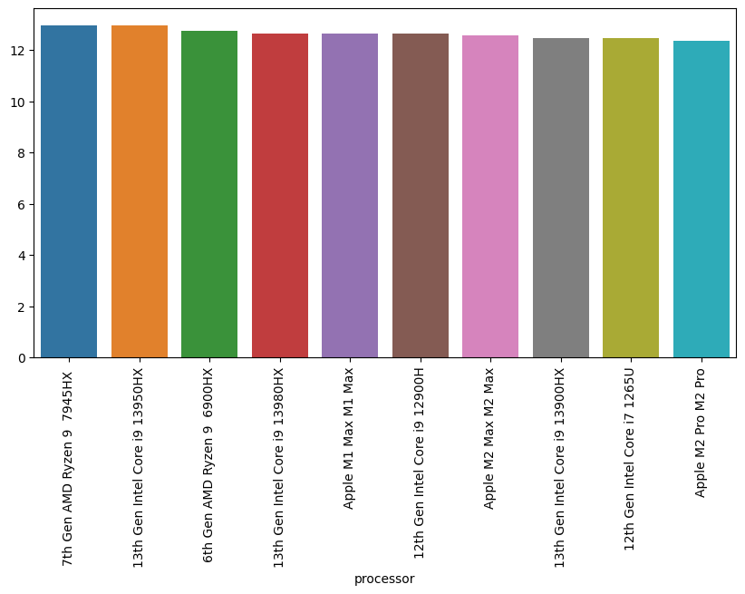

Gambar 4. Plot hubungan fitur *processor* dengan target

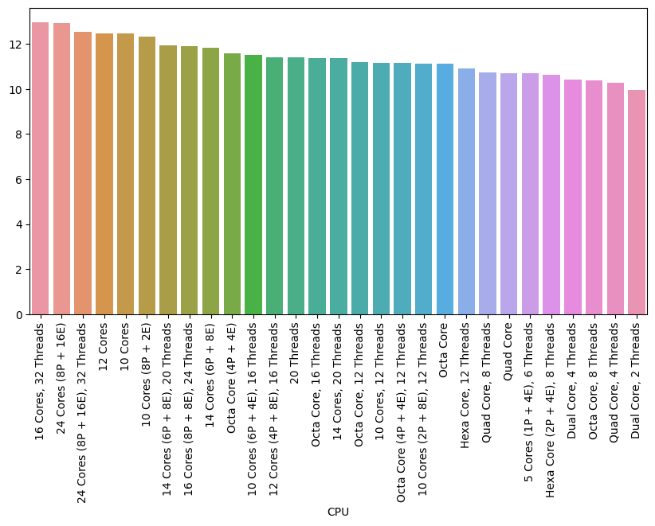

Gambar 5. Plot hubungan fitur CPU dengan target

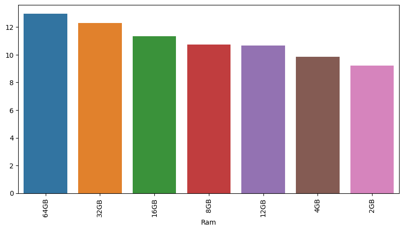

Gambar 6. Plot hubungan fitur RAM dengan target

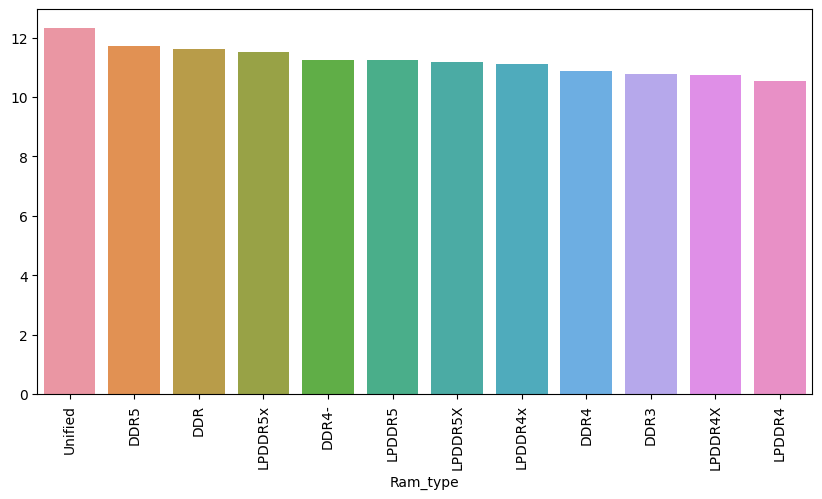

Gambar 7. Plot hubungan fitur *RAM_type* dengan target

Gambar 8. Plot hubungan fitur ROM dengan target

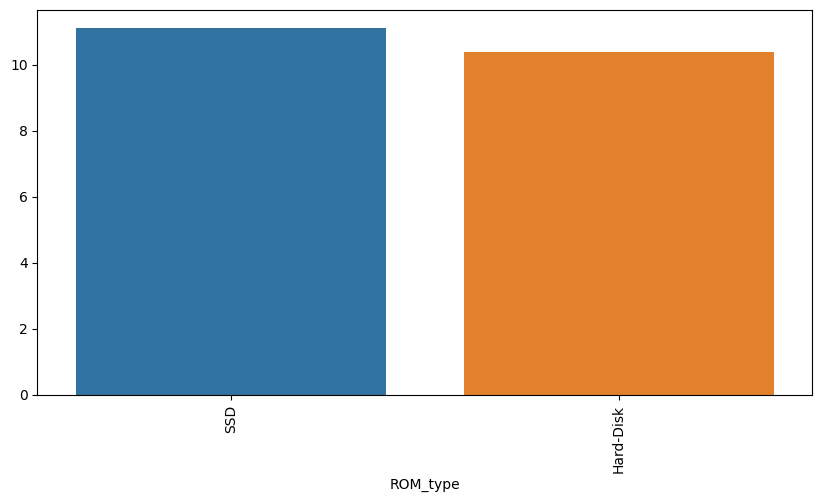

Gambar 9. Plot hubungan fitur *ROM_type* dengan target

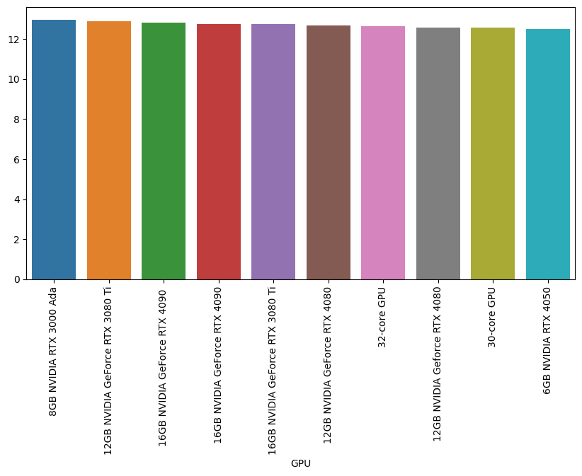

Gambar 10. Plot hubungan fitur GPU dengan target

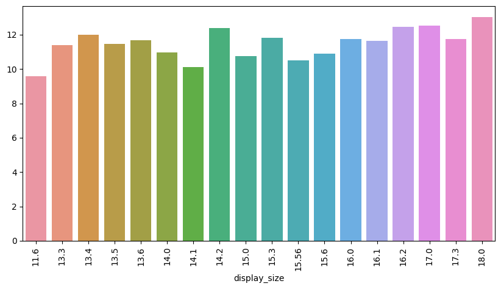

Gambar 11. Plot hubungan fitur *display_size* dengan target

Gambar 12. Plot hubungan fitur *resolution_width* dengan target

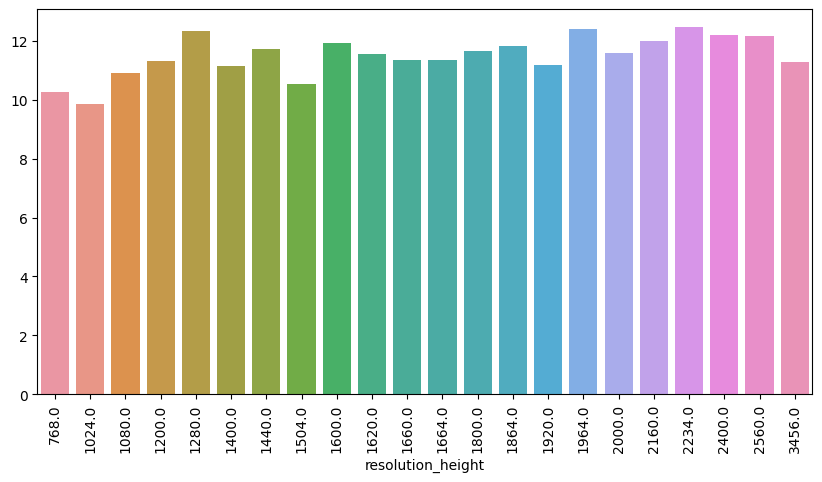

Gambar 13. Plot hubungan fitur *resolution_height* dengan target

Gambar 14. Plot hubungan fitur OS dengan target

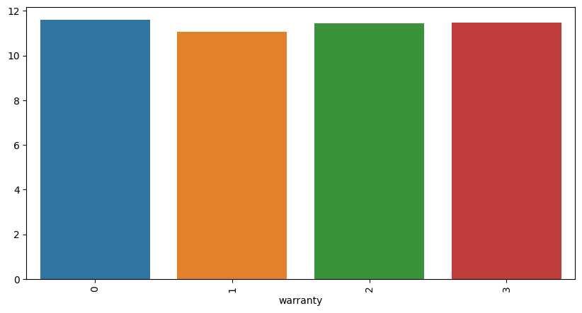

Gambar 15. Plot hubungan fitur *warranty* dengan target

## Data Preparation

**Teknik Data Preparation**:
1. *Encoding* fitur kategorik
2. *Log transfrom* pada kolom price
3. *Splitting dataset* dengan proporsi 90% *train* dan 10% *test*

**Mengapa?**: 
- Kebanyakan fitur adalah fitur kategorik, agar model dapat memprosesnya diperlukan *encoding* pada fitur-fitur tersebut.
- Distribusi harga pada kolom target terlihat condong ke kanan (*skewed rigth*) agar menjadi distribusi yang normal dapat dilakukan *log transformation*.
- Pemisahan dataset dibuat 90:10 karena jumlah dataset yang cukup kecil, sehingga proporsi *test* nya tidak butuh terlalu besar agar model dapat memiliki data *train* yang lebih banyak

## Modeling

**Tahapan Pemodelan**:
1. Melakukan *baseline modeling* sebagai tolak ukur pertama bagi model nantinya.
2. Menggunakan *ensemble model* yaitu *Random Forest* yang cukup handal.
3. *Hyperparameter tuning* untuk mencari *parameter* terbaik model.

**Kelebihan dan Kekurangan**:
- Kelebihan : *Random Forest* sendiri adalah sebuah model dengan basis *tree* dikombinasikan dengan metode *ensemble* yang membuatnya menjadi cukup kompleks, sehingga handal dalam mengatasi permasalahan yang cukup rumit sekalipun.
- Kelemahan : Karena kompleksitasnya tersebut, model *Random Forest* rawan terhadap kasus *overfitting*.

**Proses improvement**:
- Menggunakan *Grid Search* untuk mencari kombinasi *hyperparameter* terbaik.
- Menerapkan *hyperparameter* terbaik pada model sebagai langkah terakhir.
- Sehingga *parameter* terakhir yang di dapatkan selama proses *modeling* adalah `RandomForestRegressor(max_depth=20, min_samples_leaf=2, n_estimators=200, random_state=123)`.

## Evaluation
**ACTUAL VS PREDICTION**:
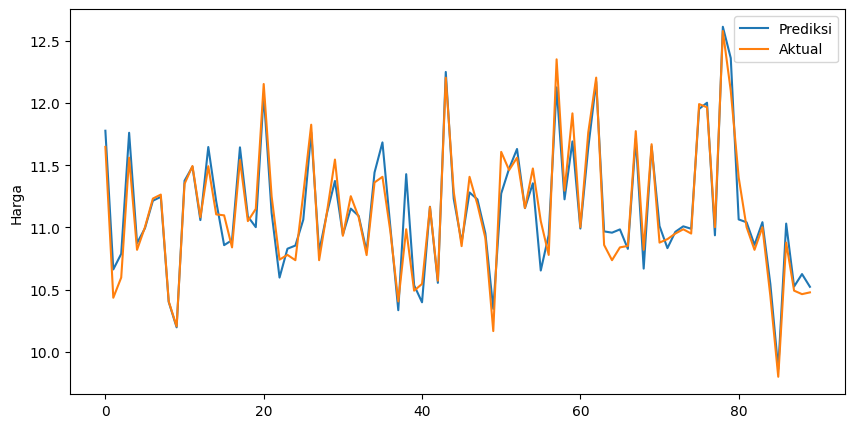

Gambar 16. *Actual vs Prediction plot*

**Metrik Evaluasi**:
- *Mean Squared Error* (MSE) untuk mengukur akurasi prediksi harga.
- *R-Squared* (R2) untuk mengevaluasi seberapa baik model cocok dengan data.

**Hasil Proyek**:
- MSE final : 0.018179004098177517
- R2 final : 0.9321405131792965

**Penjelasan Metrik Evaluasi**:
- MSE memberikan ukuran seberapa dekat prediksi dengan nilai sebenarnya. Semakin rendah, semakin baik performa model.
- R2 mengukur seberapa baik model cocok dengan data, dengan nilai mendekati 1 menunjukkan cocok yang sempurna.

**Implikasi Praktis dari Hasil Proyek**:
1. Ketidakpastian Model:

    - Meskipun model *Random Forest* yang dikembangkan memiliki performa yang tinggi dengan MSE sekitar 0.018 dan R2 sekitar 0.932, penting untuk diingat bahwa semua model memiliki batasan dan ketidakpastian.
    - Ketidakpastian dapat berasal dari variasi alamiah dalam data atau kemungkinan perubahan dalam tren pasar dan teknologi. Oleh karena itu, pengguna model sebaiknya mempertimbangkan tingkat ketidakpastian ini dalam pengambilan keputusan.

2. Keputusan Bisnis:

    - Model prediksi harga laptop dapat memberikan nilai tambah besar dalam pengambilan keputusan bisnis. Misalnya, produsen dapat menggunakan prediksi harga untuk menentukan harga yang kompetitif, sementara konsumen dapat memanfaatkannya untuk merencanakan pembelian sesuai dengan anggaran.
    - Pengecer dapat mengoptimalkan stok mereka dengan mempertimbangkan prediksi harga produk baru, dan analisis pengaruh fitur terhadap harga dapat membantu perusahaan memahami faktor-faktor kunci yang memengaruhi penentuan harga.

3. Penerapan Strategi Pemasaran:

    - Dengan mengetahui fitur-fitur yang paling berpengaruh terhadap harga, perusahaan dapat merancang strategi pemasaran yang lebih efektif. Misalnya, fokus pada peningkatan spesifikasi tertentu yang memiliki dampak positif pada harga.

4. Keandalan dan Keterbatasan:

    - Model ini dapat diandalkan untuk memberikan estimasi harga laptop dengan akurasi tinggi, terutama ketika digunakan untuk meramalkan harga pada rentang fitur yang dikenal oleh model.
    - Namun, model mungkin kurang andal saat dihadapkan dengan situasi ekstrem atau variasi yang tidak diwakili oleh data pelatihan.

5. Pemahaman Risiko:

    - Pengguna model harus memahami risiko potensial dan mempertimbangkan ketidakpastian dalam keputusan bisnis. Model ini dapat memberikan perkiraan harga, tetapi perubahan dalam kondisi pasar atau faktor eksternal dapat memengaruhi keakuratannya.
    - Melalui implementasi model ini, pengambil keputusan dapat memanfaatkan prediksi harga untuk meningkatkan efisiensi operasional, merencanakan strategi pemasaran yang lebih baik, dan membuat keputusan bisnis yang lebih informasional. Namun, pengguna perlu memahami batasan dan ketidakpastian yang melekat dalam model ini untuk pengambilan keputusan yang lebih bijak.

## Referensi
Referensi dari penelitian pasar, tren teknologi terbaru, dan penelitian harga laptop dapat memberikan wawasan tambahan.

- Fondy, H. W., Fajar, M., & Musdar, I. A. (2019). IMPLEMENTASI TEORI SUPPORT VECTO R MACHINE UNTUK MEMPREDIKSI HARGA PENJUALAN LAPTOP ASUS. KHARISMA Tech, 14(2), 1-9. Retrieved from [https://jurnal.kharisma.ac.id/kharismatech/article/view/238](https://jurnal.kharisma.ac.id/kharismatech/article/view/238)
- Syaiful, N. W., Nurmalitasari, N. (2023). Penerapan Regresi Linier Berganda Untuk Memprediksi Harga Laptop Dengan Menggunakan Software Python. Retrived from [http://ojs.udb.ac.id/index.php/Senatib/article/view/3211](http://ojs.udb.ac.id/index.php/Senatib/article/view/3211)
