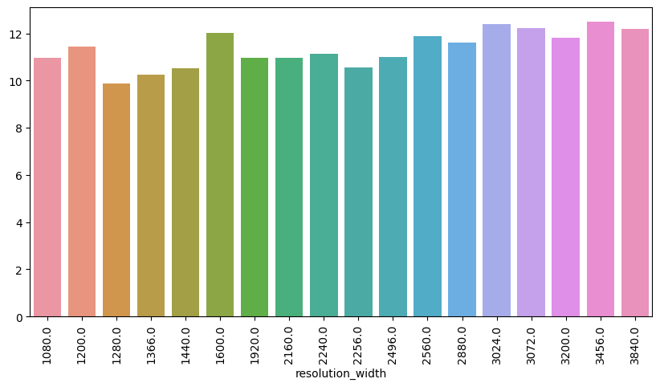
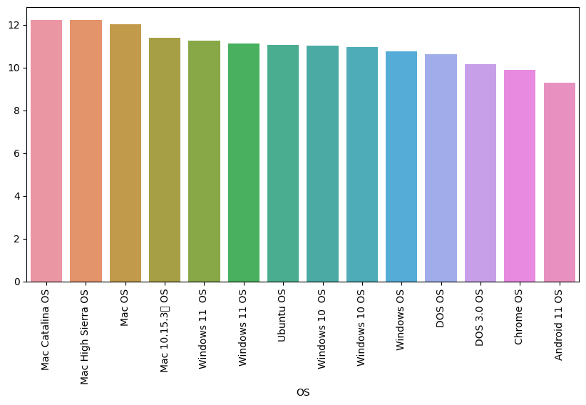

# Laporan Proyek Machine Learning - Sri Kresna Maha Dewa

## Domain Proyek
**Latar Belakang**:
Proyek ini bertujuan untuk melakukan prediksi harga laptop berdasarkan berbagai fitur dan variabel tertentu. Kondisi pasar yang dinamis, termasuk faktor teknologi terkini, merek, spesifikasi, dan ulasan pengguna, membuat prediksi harga menjadi tantangan yang menarik. Solusi dari proyek ini dapat membantu konsumen, pengecer, dan produsen untuk membuat keputusan yang lebih baik.

**Referensi**:
Referensi dari penelitian pasar, tren teknologi terbaru, dan penelitian harga laptop dapat memberikan wawasan tambahan.

- [IMPLEMENTASI TEORI SUPPORT VECTO R MACHINE UNTUK MEMPREDIKSI HARGA PENJUALAN LAPTOP ASUS](https://jurnal.kharisma.ac.id/kharismatech/article/view/238)
- [Penerapan Regresi Linier Berganda Untuk Memprediksi Harga Laptop Dengan Menggunakan Software Python](http://ojs.udb.ac.id/index.php/Senatib/article/view/3211)

## Business Understanding
### Problem Statements

- Bagaimana memprediksi harga laptop dengan akurasi tinggi?
- Bagaimana faktor-faktor tertentu mempengaruhi harga laptop?

### Goals

- Menciptakan model prediktif yang dapat memprediksi harga laptop.
- Mengidentifikasi fitur yang paling berpengaruh terhadap penentuan harga.

### Solution statements

- Menggunakan ensemble model yang sudah umum digunakan dan memiliki performa tinggi.
- Menerapkan baseline model yaitu model pertama tanpa pemrosesan terhadap data, hal ini dilakukan untuk melihat seberapa kompleks masalah yang dihadapi. Melalui baseline model ini, kita dapat membandingkannya dengan model terakhir sebagai tolak ukur.
- Melakukan feature engineering dari korelasi antar variable dalam datasets untuk menciptakan sebuah fitur baru yang lebih representatif untuk model
- Melakukan hyperparameter tuning untuk melihat sejauh mana model dapat berkembang.

## Data Understanding

**Informasi Data**:
- Jumlah data : 893
- Kondisi data : tidak ada nilai kosong ataupun duplikat(null value/NaN)
- Sumber data : [Laptop Price Prediction Dataset](https://www.kaggle.com/datasets/jacksondivakarr/laptop-price-prediction-dataset)

### Variabel-variabel pada datasets adalah sebagai berikut :

- Unnamed: 0.1 : Index column
- Unnamed: 0 : Extra column
- brand : Merek atau pabrikan laptop
- name : nama model laptop
- price : harga retail dari laptop
- spec_rating : rating dari keseluruhan spesifikasi laptop
- processor : informasi umum tentang prosesor laptop
- cpu : informasi umum tentang CPU laptop
- Ram : jumlah RAM dalam GB
- Ram_type : tipe dari RAM yang digunakan
- ROM : jumlah dari ROM
- ROM_type : tipe dari ROM yang digunakan
- GPU : informasi umum tentang GPU laptop
- display_size : informasi ukuran tampilan
- resolution_width : informasi lebar resolusi
- resolution_height : informasi tinggi resolusi
- OS : tipe dari OS yang digunakan
- warranty : jumlah garansi yang ditawarkan

### EDA (Exploratory Data Analysis) :

Distribusi kolom target :

Plot hubungan fitur dengan target :

## Data Preparation

**Teknik Data Preparation**:
1. Encoding fitur kategorik
2. Log transfrom pada price

**Mengapa?**: 
- Kebanyakan fitur adalah fitur kategorik, agar model dapat memprosesnya diperlukan encoding pada fitur-fitur tersebut.
- Distribusi harga pada kolom target terlihat condong ke kanan (skewed rigth) agar menjadi distribusi yang normal dapat dilakukan log transformation.

## Modeling

**Tahapan Pemodelan**:
1. Melakukan baseline modeling sebagai tolak ukur pertama bagi model nantinya.
2. Menggunakan ensemble model yaitu Random Forest yang cukup handal.
3. Hyperparameter tuning untuk mencari parameter terbaik model.

**Kelebihan dan Kekurangan**:
- Kelebihan : Random Forest sendiri adalah sebuah model dengan basis tree dikombinasikan dengan metode ensemble yang membuatnya menjadi cukup kompleks, sehingga handal dalam mengatasi permasalahan yang cukup rumit sekalipun.
- Kelemahan : Karena kompleksitasnya tersebut, model Random Forest rawan terhadap kasus overfitting.

**Proses improvement**:
- Menggunakan Grid Search untuk mencari kombinasi hyperparameter terbaik.
- Menerapkan hyperparameter terbaik pada model sebagai langkah terakhir.

## Evaluation
**ACTUAL VS PREDICTION**:

**Metrik Evaluasi**:
- Mean Squared Error (MSE) untuk mengukur akurasi prediksi harga.
- R-Squared (R2) untuk mengevaluasi seberapa baik model cocok dengan data.

**Hasil Proyek**:
- MSE final : 0.018179004098177517
- R2 final : 0.9321405131792965

**Penjelasan Metrik Evaluasi**:
- MSE memberikan ukuran seberapa dekat prediksi dengan nilai sebenarnya. Semakin rendah, semakin baik performa model.
- R2 mengukur seberapa baik model cocok dengan data, dengan nilai mendekati 1 menunjukkan cocok yang sempurna.

